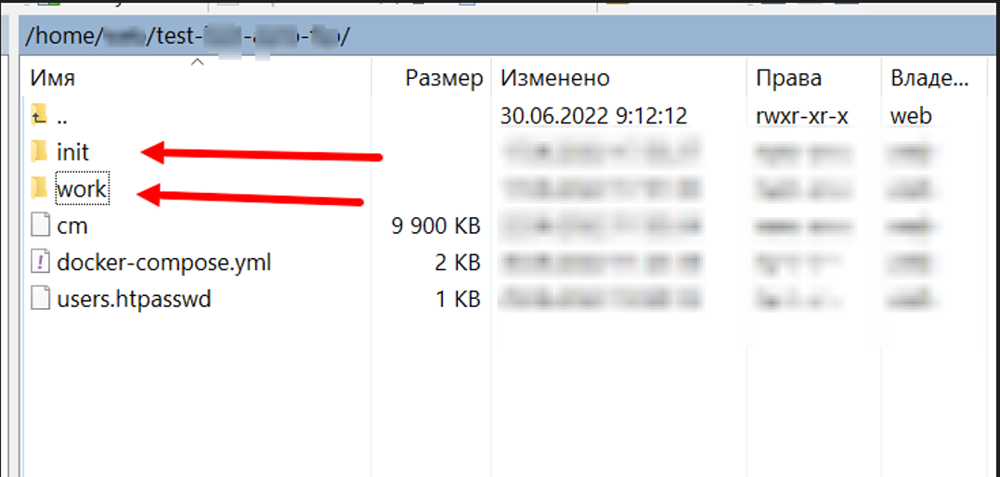
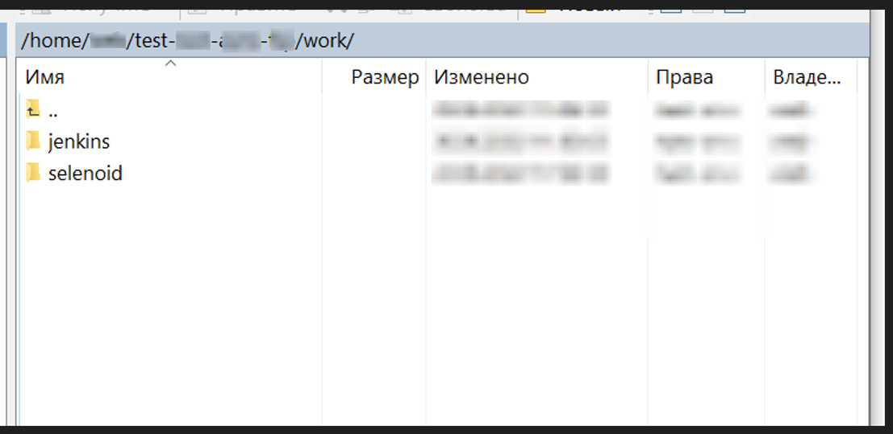
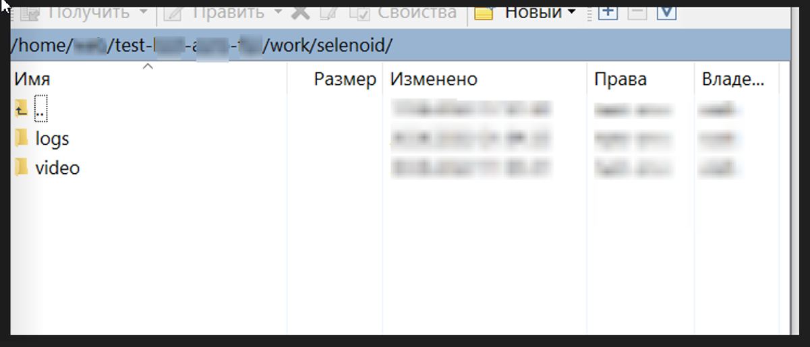
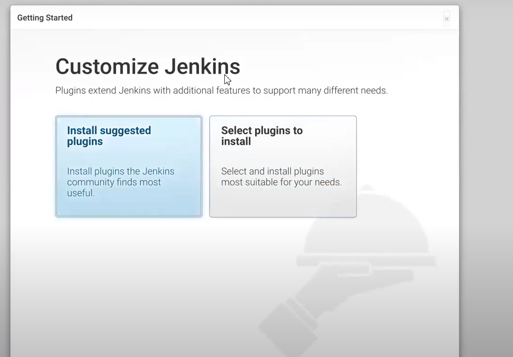
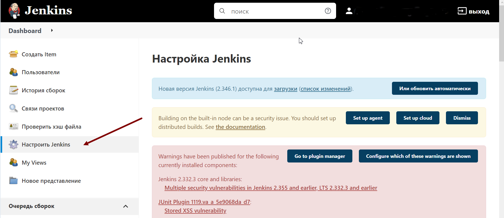
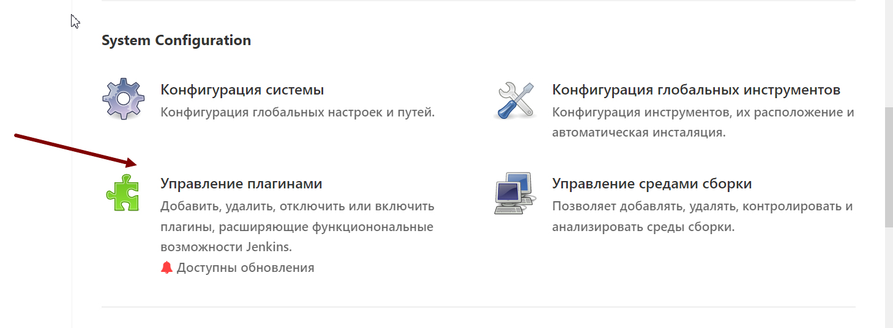
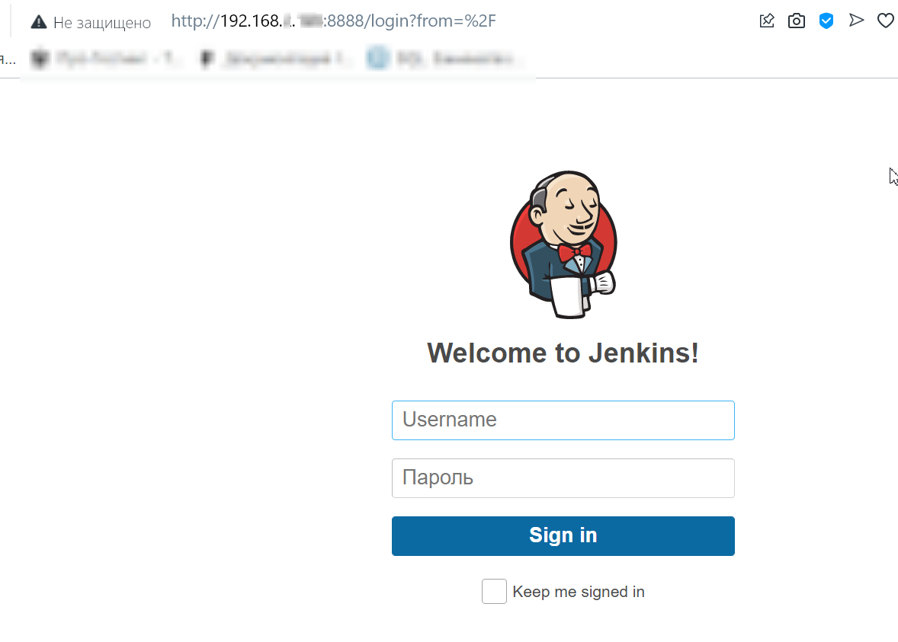
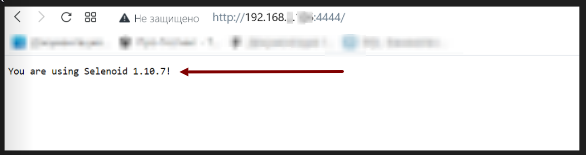
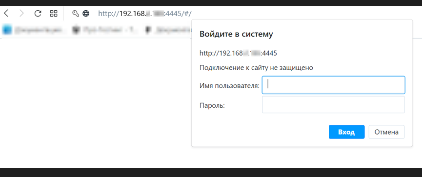
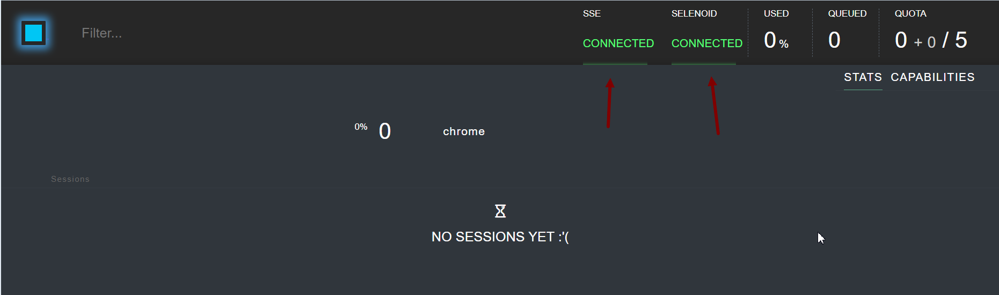

## Развертывание окружения для авто тестирования

### Technology Stack


##    Подготовка

Скачиваем и устанавливаем <a target="_blank" href="https://gitforwindows.org/">Git bash</a> и <a target="_blank" href="https://winscp.net/eng/download.php">WinSCP</a>.

Открываем WinSCP заходим на выделенный сервер создаём папку test-stand.

Внутри папки test-stand создаём папку work и init.



Внутри папки work создаём папку jenkins и папку selenoid.



Внутри папки selenoid создаём папку video и папку logs.



Внутри папки init создаём папку Selenoid внутри папки Selenoid создаём файл <a target="_blank" href="https://github.com/Konyaz/Testing_infrastructure/blob/master/test-stand/init/selenoid/browsers.json">browsers.json</a> .


Открываем git bash заходим на сервер командой:

```bash
ssh юзернейм@192.168.x.xxx
```
Вводим пароль если требуется, переходим в созданную папку test-stand командой:
```bash
cd test-stand
```


##    Установка Java


Проверяем, наличие Java командой:
```bash
java --version
```
Если Java не установлена - Инструкция по установке [Java JDK](./src/images/pages/Java.md)

## Установка Docker


Проверяем, установлен ли Docker командой:
```bash
docker --version
```

Если Docker не установлен - Инструкция по установке [Docker](./src/images/pages/Docker.md).


## Установка Docker Compose


Проверяем, есть ли у нас Docker Compose командой:
```bash
docker-compose --version
```
Если Docker Compose не установлен - Инструкция по установке [Docker Compose](./src/images/pages/DockerCompose.md).

## Установка Jenkins

После того как установлена Java, прописана её переменная окружения, установлены и проверены Docker и Docker-compose

Открываем WinSCP и заходим в папку test-stand.

Внутри папки test-stand создаём файл docker-compose.yml


Сохраняем код из файла <a target="_blank" href="https://github.com/Konyaz/Testing_infrastructure/blob/master/test-stand/docker-compose(Jenkins).yml">docker-compose(Jenkins).yml</a> вставляем его на сервер в папку test-stand в файл docker-compose.yml для установки Jenkins:


Открываем Git bash На сервере переходим в папку test-stand командой:
```bash
cd test-stand
```
Пишем команду для остановки контейнеров:
```bash
sudo docker-compose down
```
После пишем команду, для того чтоб установить образ:
```bash
sudo docker-compose pull
```
Проверяем установлен ли образ командой:
```bash
sudo docker-compose imgge list
```


После того как убедились что образ установлен успешно, пишем команду для запуска контейнера:
```bash
sudo docker-compose up
```
После первого запуска сохраняем password (пароль). Он показывается после первого запуска поэтому важно его сохранить：


Заходим в Jenkins по адресу http://192.168.x.xxx:8888

Вводим сохраненный до этого пароль в поле Administrator password.


Устанавливаем плагины нажимая Install suggested plugins.



Задаем логин и пароль для администратора.


Переходим в настройки.



Устанавливаем плагины: GitLab , Post build task, Text File Operations, Allure Jenkins Plugin.



Переходим в “Конфигурация глобальных инструментов”.

Настраиваем:

JDK: (Имя: jdk11, JAVA_HOME: $JAVA_HOME )


Gradle: (name: gradle Версия: Gradle 6.8.3)


Allure Commandline: ( Имя: allure Версия: последняя)


#### Jenkins установлен и настроен.


## Устанавливаем Selenoid и Selenoid UI

Открываем Git bash На сервере переходим в папку test-stand командой:
```bash
cd test-stand
```
Пишем команду для остановки контейнера:
```bash
docker-compose down
```

Открываем WinSCP заходим на сервер в папку test-stand открываем docker-compose.yml


Сохраняем код из файла  <a target="_blank" href="https://github.com/Konyaz/Testing_infrastructure/blob/master/test-stand/docker-compose.yml">docker-compose.yml</a> и вставляем его на сервер в папку test-stand в файл docker-compose.yml для установки Selenoid и Selenoid UI:

  

Сохраняем.


Для того чтоб запаролить Selenoid Ui **(Пароль на Selenoid UI Не одно и тоже что пароль на CREATE SESSION .**

**Пароль на CREATE SESSION (Selenoid) устанавливается через nginx reverse proxy  перед SELENOID либо ставится ggr )**

Заходим на сайт https://hostingcanada.org/htpasswd-generator/

Htpasswd Generator (https://hostingcanada.org/htpasswd-generator/)  - генерируем строку.
В директории c файлом docker-compose.yml создаём файл users.htpasswd


В созданный файл вставляем сгенерированную строку. Сохраняем.

Открываем Git bash на сервере переходим в папку test-stand командой:

```bash
cd test-stand
```
Пишем команду для запуска контейнеров :
```bash
docker-compose up -d
```


#### Selenoid и Selenoid UI установлены.

## Проверка


##### Проверка Jenkins

Переходим по адресу http://192.168.x.xxx:8888

При верной установке Jenkins, должна отображаться страница авторизации.




##### Проверка Selenoid

Переходим по адресу http://192.168.x.xxx:4444

При верной установке Selenoid, должна отображаться надпись:

You are using Selenoid x.xx.x!




##### Проверка Selenoid UI

Переходим по адресу http://192.168.x.xxx:4445

При верной установке Selenoid UI, должна отображаться страница авторизации.



Вводим заданный логин и пароль.

После авторизации Статус SSE и SELENOID должен отображаться зелёным с надписью **CONNECTED**



## Дополнение:

<a target="_blank" href="https://github.com/Konyaz/Testing_infrastructure/blob/master/test-stand/docker-compose%20(Без%20пароля%20Selenoid%20UI).yml">docker-compose (Без пароля Selenoid UI).yml</a>


