## Развертывание окружения для авто тестирования

### Technology Stack


##    Подготовка

Скачиваем и устанавливаем Git bash и WinSCP .

Открываем WinSCP заходим на выделенный сервер создаём папку test-stand.

Внутри папки test-stand создаём папку work и init.


Внутри папки work создаём папку jenkins и папку selenoid.


Внутри папки selenoid создаём папку video и папку logs.


Внутри папки init создаём папку Selenoid внутри папки Selenoid создаём файл browsers.json
Click <a target="_blank" href="https://jenkins.autotests.cloud/job/Insales/build">here</a> to run the tests.

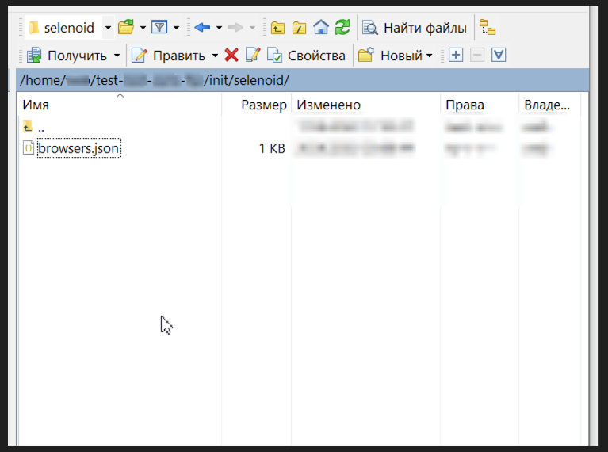


Открываем git bash заходим на сервер командой:

```bash
ssh юзернейм@192.168.x.xxx
```
Вводим пароль если требуется, переходим в созданную папку test-stand командой:
```bash
cd test-stand
```


##    Ставим JDK


Проверяем, есть ли у нас Java командой:
```bash
java --version
```
Если Java не установлена устанавливаем командой:
```bash
sudo apt-get install default-jdk
```
Соглашаемся на установку и потом ждем, пока всё установится.

Ещё раз проверяем версию Java командой:
```bash
java --version
```

## Прописываем переменную окружения JAVA_HOME

Java вероятнее всего установилась вот так:

/usr/lib/jvm/java-11-openjdk-amd64 в JAVA_HOME необходимо прописывать именно этот путь, который не включает папку bin.

Редактируем файл с переменными окружения командой:
```bash
sudo nano /etc/environment
```
Добавляем крайней строчкой (Строк может быть больше чем одна поэтому ставить нужно крайней строчкой не удаляя и не трогая другие строки):
```bash
JAVA_HOME=/usr/lib/jvm/java-11-openjdk-amd64
```
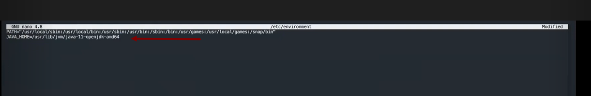

Нажимаем последовательно Ctrl+S (сохранить), Ctrl+X (выйти из редактора nano).

Обновляем сведения о переменных окружения командой:
```bash
source /etc/environment
```
Проверяем, прописалась ли переменная окружения командой:
```bash
echo $JAVA_HOME
```


## Установка Docker


Проверяем, есть ли у нас Docker командой:
```bash
docker --version
```

Устанавливаем Docker Скриптом с помощью curl командой:
```bash
sudo curl -fsSL https://get.docker.com -o get-docker.sh
```
Проверяем установку Docker командой:
```bash
docker --version
```


## Установка Docker Compose


Проверяем, есть ли у нас Docker Compose командой:
```bash
docker-compose --version
```
Устанавливаем Docker Compose Скриптом с помощью curl командой:
```bash
sudo curl -SL https://github.com/docker/compose/releases/download/v2.6.1/docker-compose-linux-x86_64 -o /usr/local/bin/docker-compose
```

Проверяем установку Docker Compose командой:
```bash
docker-compose --version
```


После того как установлена Java, прописана её переменная окружения, установлены и проверены Docker и Docker-compose

открываем WinSCP и заходим в папку test-stand.

Внутри папки test-stand создаём файл docker-compose.yml


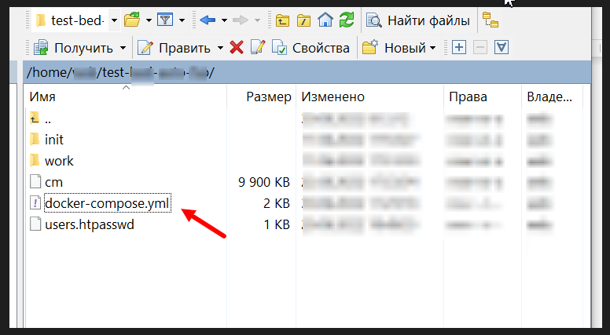

Сохраняем код из файла git репозитория docker-compose(Jenkins).yml и вставляем его на сервер в папку test-stand в файл docker-compose.yml для установки Jenkins:
Click <a target="_blank" href="https://jenkins.autotests.cloud/job/Insales/build">here</a> to run the tests.


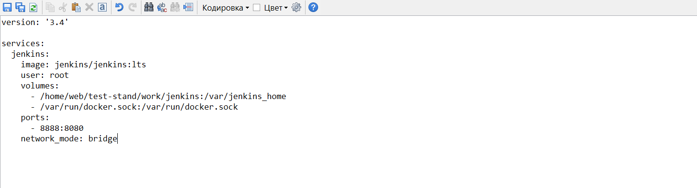


Открываем Git bash На сервере переходим в папку test-stand командой:
```bash
cd test-stand
```
Пишем команду для остановки контейнеров :
```bash
sudo docker-compose down
```
После пишем команду для того чтоб установить образ:
```bash
sudo docker-compose pull
```
Проверяем установлен ли образ командой:
```bash
sudo docker-compose imgge list
```
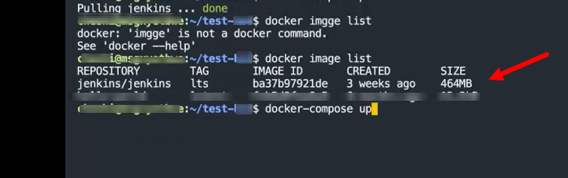

После того как убедились что образ установлен успешно, пишем команду для запуска контейнера:
```bash
sudo docker-compose up
```
После первого запуска сохраняем password ( пароль ). Он показывается после первого запуска поэтому важно его сохранить：

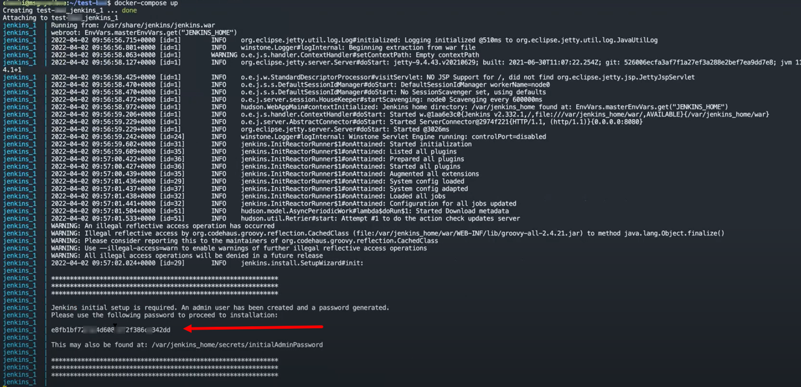

Заходим в Jenkins по адресу http://192.168.x.xxx:8888

Вводим сохраненный до этого пароль в поле Administrator password.

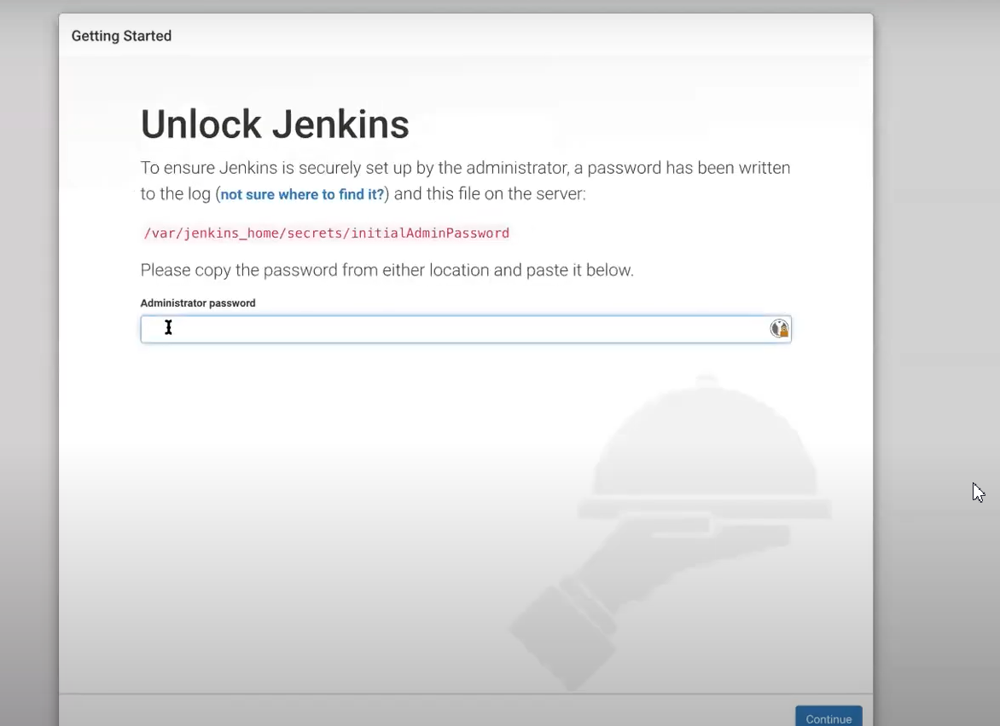

Устанавливаем плагины нажимая Install suggested plugins.


Задаем логин и пароль для администратора.

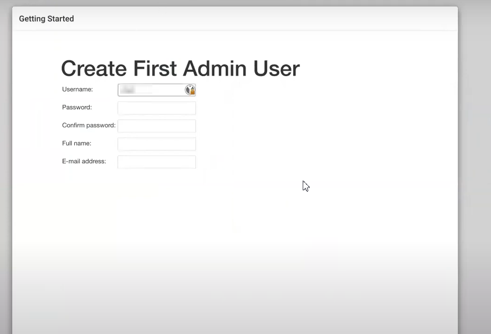

Переходим в настройки.


Устанавливаем плагины: GitLab , Post build task, Text File Operations, Allure Jenkins Plugin.


Переходим в “Конфигурация глобальных инструментов”.

Настраиваем:

JDK: (Имя: jdk11, JAVA_HOME: $JAVA_HOME )


Gradle: (name: gradle Версия: Gradle 6.8.3)

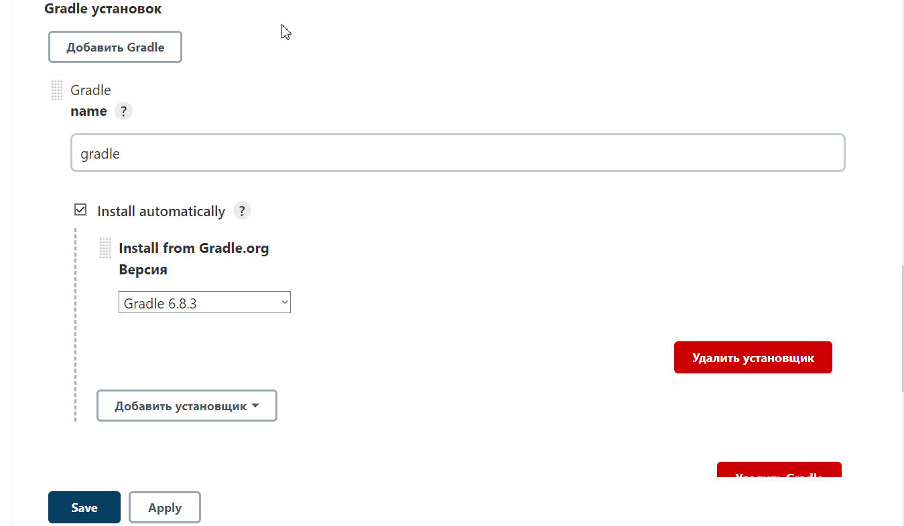

Allure Commandline: ( Имя: allure Версия: последняя)

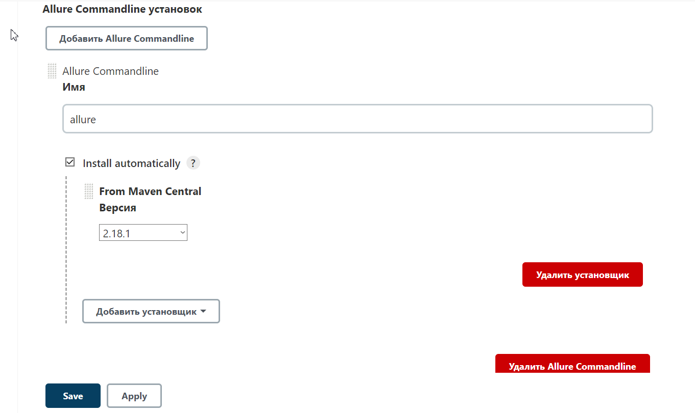

Jenkins настроен.


## Устанавливаем Selenoid и Selenoid UI

Открываем Git bash На сервере переходим в папку test-stand командой:
```bash
cd test-stand
```
Пишем команду для остановки контейнера:
```bash
docker-compose down
```

Открываем WinSCP заходим на сервер в папку test-stand открываем docker-compose.yml

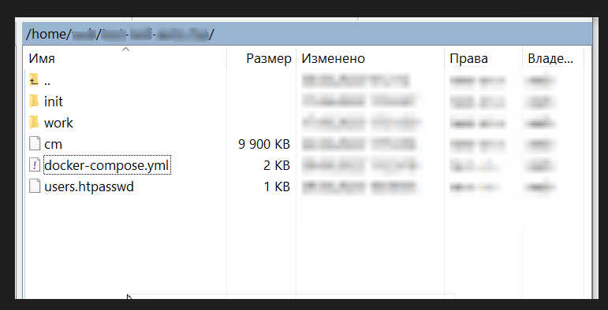

Сохраняем код из файла git репозитория docker-compose.yml и вставляем его на сервер в папку test-stand в файл docker-compose.yml для установки Jenkins:

Click <a target="_blank" href="https://jenkins.autotests.cloud/job/Insales/build">here</a> to run the tests.

Сохраняем.


Для того чтоб запаролить Selenoid Ui (Пароль на Selenoid UI Не одно и тоже что пароль на CREATE SESSION .

Пароль на CREATE SESSION (Selenoid) устанавливается через nginx reverse proxy  перед селеноидом либо ставится ggr )

Заходим на сайт https://hostingcanada.org/htpasswd-generator/

Htpasswd Generator (https://hostingcanada.org/htpasswd-generator/)  - генерируем строку.
В директории c файлом docker-compose.yml создаём файл users.htpasswd


В созданный файл вставляем сгенерированную строку. Сохраняем.

Открываем Git bash на сервере переходим в папку test-stand командой:

```bash
cd test-stand
```
пишем команду для запуска контейнеров :
```bash
docker-compose up -d
```


Selenoid и Selenoid UI установлены.


## Дополнение:

docker-compose.yml  Без пароля Selenoid Ui


### Jenkins
Click <a target="_blank" href="https://jenkins.autotests.cloud/job/Insales/build">here</a> to run the tests.

